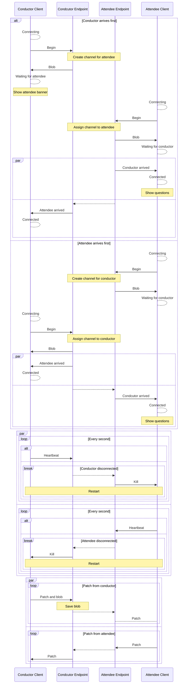

# Conduction

```mermaid
sequenceDiagram
  participant CC as Conductor Client
  participant CE as Condcutor Endpoint
  participant AE as Attendee Endpoint
  participant AC as Attendee Client

  alt Conductor arrives first
    CC-->CC: Connecting
    CC->>CE: Begin
    note over CE,AE: Create channel for attendee
    CE->>CC: Blob
    CC-->CC: Waiting for attendee
    note over CC: Show attendee banner

    AC-->AC: Connecting
    AC->>AE: Begin
    note over CE,AE: Assign channel to attendee
    AE->>AC: Blob
    AC-->AC: Waiting for conductor

    par
      AE->>AC: Conductor arrived
      AC-->AC: Connected
      note over AC: Show questions
    and
      AE-->>CE: 
      CE->>CC: Attendee arrived
      CC-->CC: Connected
    end

  else Attendee arrives first
    AC-->AC: Connecting
    AC->>AE: Begin
    note over AE,CE: Create channel for conductor
    AE->>AC: Blob
    AC-->AC: Waiting for conductor

    CC-->CC: Connecting
    CC->>CE: Begin
    note over AE,CE: Assign channel to conductor
    CE->>CC: Blob

    par
      CE->>CC: Attendee arrived
      CC-->CC: Connected
    and
      CE-->>AE: 
      AE->>AC: Condcutor arrived
      AC-->AC: Connected
      note over AC: Show questions
    end

  end
  
  par
    loop Every second
      alt
        CC->>CE: Heartbeat
      else
        break Conductor disconnected
          CE-->>AE: 
          AE->>AC: Kill
          note over AC,CC: Restart
        end
      end
    end
  and 
    loop Every second
      alt
        AC->>AE: Heartbeat
      else
        break Attendee disconnected
          AE-->>CE: 
          CE->>CC: Kill
          note over AC,CC: Restart
        end
      end
    end
  end

  par
    loop Patch from conductor
      CC->>CE: Patch and blob
      note over CE: Save blob
      CE-->>AE: 
      AE-->AC: Patch
    end
  and
    loop Patch from attendee
      AC->>AE: Patch
      AE-->>CE: 
      CE->>CC: Patch
    end
  end
```
